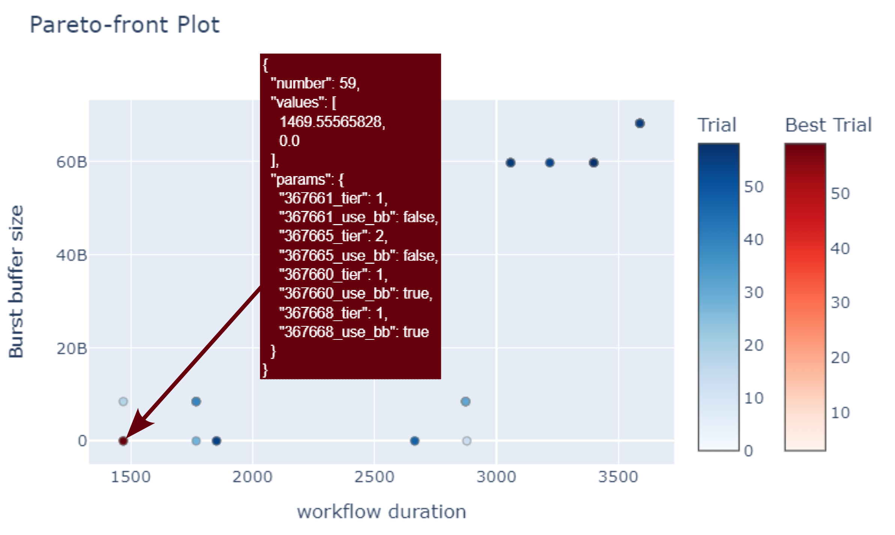

## Introduction

This document presents the Recommendation System, a sophisticated tool designed to optimize data placement in High-Performance Computing (HPC) applications. The system integrates a black box optimization engine, a mathematical model to predict application I/O behavior, a machine learning-based performance model, and a simulation engine. These components work together to explore the parameter space efficiently and simulate application execution within a virtual HPC environment. Our innovative system determines the optimal storage tier for each I/O phase, aiming to reduce the total duration and Burst Buffer usage of workflows. The proof-of-concept implementation has demonstrated promising results, signifying a leap forward for various HPC applications and laying the foundation for further enhancements.

<video src="demo/recsys_demo_compressed.mp4"></video>

---

## System Architecture

*Figure 1: The general architecture of the recommendation system.*

The architecture of the recommendation system is outlined in Figure 1. At the core, the system relies on the Workflow Description File (WDF), which is derived from WP2 and contains intricate details about application steps and storage service requirements. To harness the full potential of the recommendation system, the workflow should have been previously executed with the requisite number of compute nodes, persistent storage services, and with IO Instrumentation activated. The IO Instrumentation database is pivotal for the system as it retains workflow references and job groups, enabling the system to optimize data placement effectively.

---

## System Components

The Recommendation System is composed of several critical components:

- **Application Decomposer**: A tool that analyzes jobs and their I/O behavior from the WDF, constructing a model for each job.

- **Performance Model**: It predicts the latency for each I/O phase across different storage tiers, assessing the impact of storage performance on job I/O.

- **Execution Simulator**: This tool virtually replays the workflow on each storage tier, integrating job representation and anticipated storage performance.

- **Optimization Heuristics**: These heuristics optimize placement combinations and their performance impact, taking into account predicted performance and workflow chronology.

| Component               | Release               | Key Features                                                                                                  |
|-------------------------|-----------------------|---------------------------------------------------------------------------------------------------------------|
| Application Decomposer  | 0.2 (Second Release)  | Analyzes each job’s dataflow timeseries, categorizing I/O and compute phases. Connects to IO Instrumentation.  |
| Performance Model       | 0.1 (First Release)   | Predicts the latency for each I/O phase on each storage tier. Builds a mathematical model of I/O behavior.     |
| Execution Simulator     | 0.2.1 (Second Release)| Virtually replays the workflow on each storage tier, using the job representation and expected storage performance.|
| optimisation Heuristics | 0.1 (First Release)   | Optimises the placement combinations for performance impact, considering workflow chronology and predicted performance. |
| IO Instrumentation Interface | 0.1 (First Release)   | Connects to an IO Instrumentation session to retrieve time-series data for workflow job analysis.                |
| WDF Interface           | 0.0 (Not Released)    | To be developed for integration with Workflow Manager, for structured description and storage service requirements. |

*Table 1: Development status of the components.*

---

## Implementation Process

The Recommendation System's implementation involved identifying necessary components, standardizing data formats, and streamlining data flow between components. The journey from conception to the first version took place over the last 12 months, culminating in the development of key features, testing, and presentation at workshops. As we progress, the focus is now on integrating the remaining elements, including the Workflow Manager from WP2 and the Performability Predictor.

---

## Operational Workflow

The operational workflow of the Recommendation System commences with the App Decomposer analyzing the WDF's job list and extracting their I/O behavior. The Performance Model and Execution Simulator step in to predict I/O latencies and virtually replay the workflow, respectively. The ultimate decisions are made by the Optimization Heuristics, which deduce the most suitable solution for data placement.

---

## Optimization Strategies

The optimization strategies employed by the system are designed to be robust, taking into account the simulation results and a range of possible storage tier placements. The IO Instrumentation Interface serves as a critical link, retrieving job-related data to facilitate optimization.

---

## Main Results

The system has proven effective in reducing workflow durations and optimizing the use of Burst Buffer. The figures accompanying this document illustrate the relative and absolute comparisons of runtime on different tiers against simulation runtime by flavor, underscoring the efficiency of the system.

*Figure: This Pareto-front plot demonstrates the trade-off between workflow duration and burst buffer size in a Lattice Quantum Chromodynamics (LQCD) use-case. Each point on the plot represents a unique configuration of job data placement, with the x-axis indicating the total workflow duration and the y-axis showing the burst buffer size required. The color gradient reflects the density of trials: darker areas represent a higher concentration of trial configurations. The red point labeled 'Best Trial' signifies the optimal configuration found that minimizes the workflow duration while using no burst buffer. This optimal solution details the specific job assignments for tier placement and burst buffer usage, marking a significant improvement in performance without increasing resource consumption.*

*Figure: The scatter plot compares the measured runtime of Step BC from an LQCD simulation (in seconds) to the predicted runtime by a recommendation system (RecSys) simulation across different 'flavor' sizes (in GB) on the afsm tier. Each point on the graph represents a comparison of the actual measured runtime (blue dot) against the RecSys simulated runtime (red dot) for a given flavor size. A close clustering of blue and red points suggests a high accuracy of the simulation model in predicting the actual runtime for the LQCD workflow.*

*Figure: This scatter plot presents a comparison of the actual measured runtime of Step BC from an LQCD simulation against the RecSys simulation runtime, categorized by flavor sizes (in GB) on the p_project tier. Blue dots indicate the measured runtime for each flavor, while red dots represent the corresponding simulation runtime predicted by the recommendation system. The plot illustrates the relationship between the computational resource allocation (flavor size) and the efficiency of the simulation in approximating the real-world runtime of LQCD workflows.*

---

## Impact and Benefits

The implementation of the Recommendation System has shown significant impact across various HPC application domains, leading to substantial benefits in workflow efficiency and resource utilization.

---

## Future Directions

Future research aims at furthering the capabilities of the Recommendation System, focusing on improving integration with existing workflow managers, expanding on the Performability Predictor, and advancing the system's overall performance.

---
## Repo Summary
**Date**: 2024-04-09 11:10:50

**Directory**: `/iosea-wp3-recommendation-system`

**Total**: 299 files, 106700 codes, 52 comments, 4120 blanks, all 110872 lines

### Languages

| Language         | Files | Code   | Comment | Blank | Total |
|------------------|-------|--------|---------|-------|-------|
| CSV              | 173   | 87,443 | 0       | 173   | 87,616|
| Python           | 91    | 18,608 | 0       | 3,821 | 22,429|
| YAML             | 20    | 335    | 52      | 82    | 469   |
| Database         | 1     | 134    | 0       | 0     | 134   |
| ini              | 8     | 116    | 0       | 40    | 156   |
| pip requirements | 4     | 52     | 0       | 4     | 56    |
| jsonc            | 1     | 8      | 0       | 0     | 8     |
| Jinja            | 1     | 4      | 0       | 0     | 4     |
