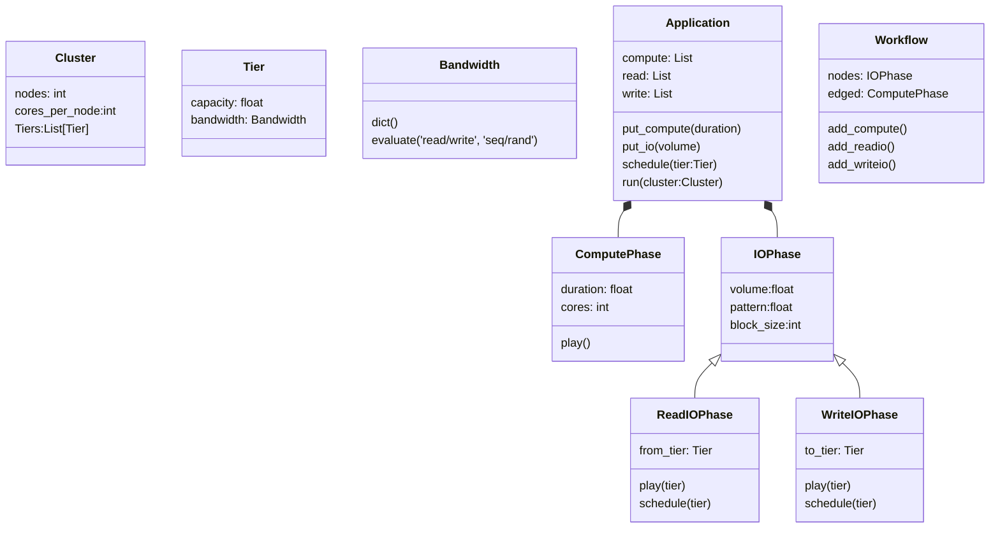

```mermaid
classDiagram
    class Cluster{
        nodes: int
        cores_per_node:int
        Tiers:List[Tier]
    }
    class Tier{
        capacity: float
        bandwidth: Bandwidth
    }
    class Bandwidth {
        dict()
        evaluate('read/write', 'seq/rand')
    }
    class ComputePhase{
        duration: float
        cores: int
        play()
    }
    class IOPhase{
        volume:float
        pattern:float
        block_size:int
    }
    class ReadIOPhase{
        from_tier: Tier
        play(tier)
        schedule(tier)
    }
    class WriteIOPhase{
        to_tier: Tier
        play(tier)
        schedule(tier)
    }
    class Application{
        compute: List
        read: List
        write: List
        put_compute(duration)
        put_io(volume)
        schedule(tier:Tier)
        run(cluster:Cluster)
    }
    IOPhase <|-- ReadIOPhase
    IOPhase <|-- WriteIOPhase
    %% ReadIOPhase--Tier
    Application *-- IOPhase
    Application *-- ComputePhase
    %% Application --> Tier
    %% Tier -->Bandwidth

    class Workflow{
        nodes: IOPhase
        edged: ComputePhase
        add_compute()
        add_readio()
        add_writeio()
    }
```