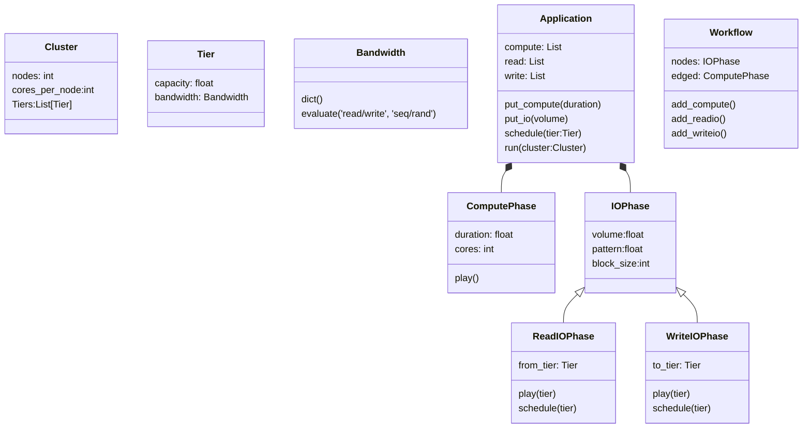

<table class="index" data-sortable>
        <thead>
            <tr class="tablehead" title="Click to sort">
                <th class="name left" aria-sort="none" data-shortcut="n">Module</th>
                <th aria-sort="none" data-default-sort-order="descending" data-shortcut="s">statements</th>
                <th aria-sort="none" data-default-sort-order="descending" data-shortcut="m">missing</th>
                <th aria-sort="none" data-default-sort-order="descending" data-shortcut="x">excluded</th>
                <th class="right" aria-sort="none" data-shortcut="c">coverage</th>
            </tr>
        </thead>
        <tbody>
            <tr class="file">
                <td class="name left"><a href="d_e19319c698d56c7e___init___py.html">cluster_simulator\__init__.py</a></td>
                <td>0</td>
                <td>0</td>
                <td>0</td>
                <td class="right" data-ratio="0 0">100%</td>
            </tr>
            <tr class="file">
                <td class="name left"><a href="d_e19319c698d56c7e_analytics_py.html">cluster_simulator\analytics.py</a></td>
                <td>192</td>
                <td>67</td>
                <td>0</td>
                <td class="right" data-ratio="125 192">65%</td>
            </tr>
            <tr class="file">
                <td class="name left"><a href="d_e19319c698d56c7e_application_py.html">cluster_simulator\application.py</a></td>
                <td>103</td>
                <td>3</td>
                <td>0</td>
                <td class="right" data-ratio="100 103">97%</td>
            </tr>
            <tr class="file">
                <td class="name left"><a href="d_e19319c698d56c7e_cluster_py.html">cluster_simulator\cluster.py</a></td>
                <td>102</td>
                <td>9</td>
                <td>0</td>
                <td class="right" data-ratio="93 102">91%</td>
            </tr>
            <tr class="file">
                <td class="name left"><a href="d_5c0f19d45edc3e2c___init___py.html">cluster_simulator\notebooks\__init__.py</a></td>
                <td>0</td>
                <td>0</td>
                <td>0</td>
                <td class="right" data-ratio="0 0">100%</td>
            </tr>
            <tr class="file">
                <td class="name left"><a href="d_e19319c698d56c7e_phase_py.html">cluster_simulator\phase.py</a></td>
                <td>255</td>
                <td>9</td>
                <td>0</td>
                <td class="right" data-ratio="246 255">96%</td>
            </tr>
            <tr class="file">
                <td class="name left"><a href="d_7ca7a22f67752698___init___py.html">cluster_simulator\tests\__init__.py</a></td>
                <td>0</td>
                <td>0</td>
                <td>0</td>
                <td class="right" data-ratio="0 0">100%</td>
            </tr>
            <tr class="file">
                <td class="name left"><a href="d_7ca7a22f67752698_test_py.html">cluster_simulator\tests\test.py</a></td>
                <td>81</td>
                <td>2</td>
                <td>0</td>
                <td class="right" data-ratio="79 81">98%</td>
            </tr>
            <tr class="file">
                <td class="name left"><a href="d_7ca7a22f67752698_test_application_py.html">cluster_simulator\tests\test_application.py</a></td>
                <td>250</td>
                <td>1</td>
                <td>0</td>
                <td class="right" data-ratio="249 250">99%</td>
            </tr>
            <tr class="file">
                <td class="name left"><a href="d_7ca7a22f67752698_test_cluster_tiers_py.html">cluster_simulator\tests\test_cluster_tiers.py</a></td>
                <td>126</td>
                <td>0</td>
                <td>0</td>
                <td class="right" data-ratio="126 126">100%</td>
            </tr>
            <tr class="file">
                <td class="name left"><a href="d_7ca7a22f67752698_test_phase_py.html">cluster_simulator\tests\test_phase.py</a></td>
                <td>399</td>
                <td>1</td>
                <td>0</td>
                <td class="right" data-ratio="398 399">99%</td>
            </tr>
            <tr class="file">
                <td class="name left"><a href="d_e19319c698d56c7e_utils_py.html">cluster_simulator\utils.py</a></td>
                <td>154</td>
                <td>78</td>
                <td>0</td>
                <td class="right" data-ratio="76 154">49%</td>
            </tr>
        </tbody>
        <tfoot>
            <tr class="total">
                <td class="name left">Total</td>
                <td>1662</td>
                <td>170</td>
                <td>0</td>
                <td class="right" data-ratio="1492 1662">90%</td>
            </tr>
        </tfoot>
    </table>
    
    

